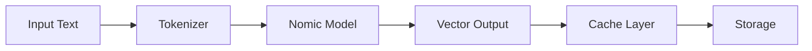
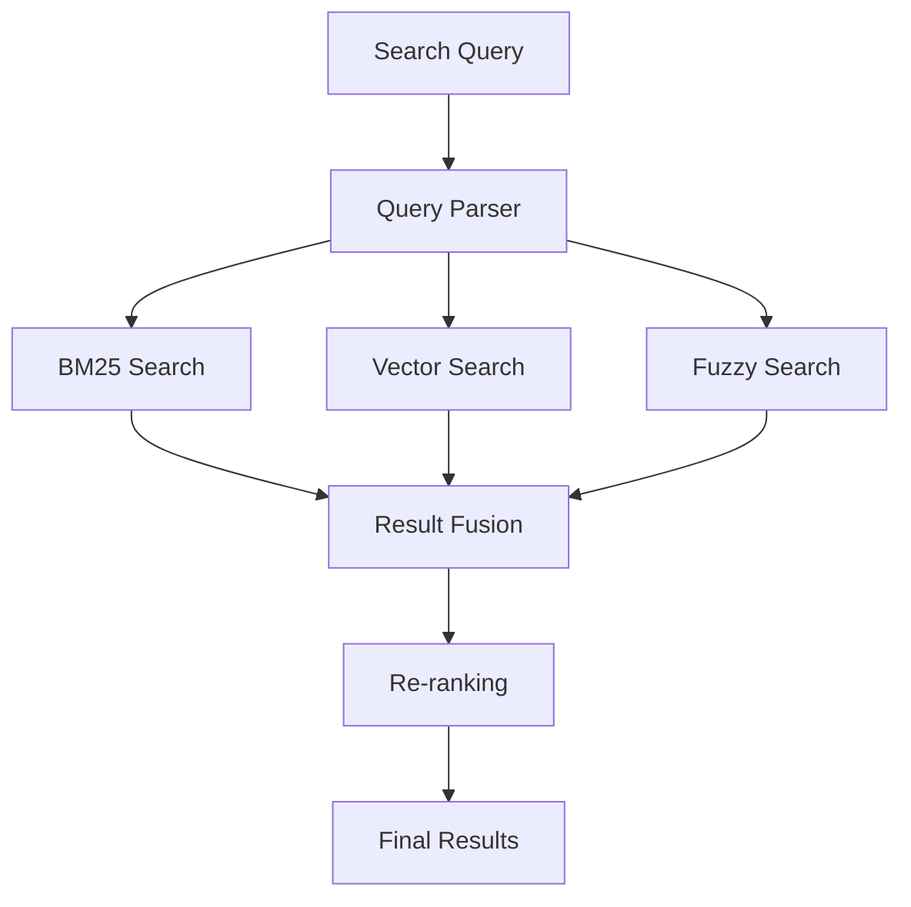

# RAG System Architecture

## System Overview

The RAG (Retrieval-Augmented Generation) system is a high-performance, modular architecture designed for efficient document retrieval and semantic search using state-of-the-art embeddings.

## Core Components

### 1. Embedding Pipeline



**Key Features:**
- Nomic-Embed-Code model (768-dimensional vectors)
- Streaming processing with backpressure control
- Three-tier caching (L1: Hot, L2: Warm, L3: Cold)

### 2. Search Architecture



**Search Modes:**
- **BM25**: Traditional keyword-based search
- **Vector**: Semantic similarity using cosine distance
- **Fuzzy**: Approximate string matching
- **Hybrid**: Weighted fusion of all methods

### 3. Storage System

**LanceDB Integration:**
- Columnar storage optimized for vectors
- Zero-copy data access
- Automatic indexing and partitioning
- ACID compliance for data integrity

**Memory Architecture:**
```
┌─────────────────────────────────┐
│     Application Layer           │
├─────────────────────────────────┤
│     Cache Layer (LRU)           │
├─────────────────────────────────┤
│     Vector Pool                 │
├─────────────────────────────────┤
│     LanceDB Storage             │
└─────────────────────────────────┘
```

### 4. Caching Strategy

**Three-Tier Cache:**
1. **L1 Cache** (Hot - In-Memory)
   - Size: 1000 entries
   - TTL: 5 minutes
   - Access: O(1)

2. **L2 Cache** (Warm - Memory-Mapped)
   - Size: 10,000 entries
   - TTL: 1 hour
   - Access: O(1) amortized

3. **L3 Cache** (Cold - Disk)
   - Size: Unlimited
   - TTL: 24 hours
   - Access: O(log n)

### 5. Memory Optimization

**Techniques Used:**
- Zero-copy operations via memory mapping
- SIMD acceleration for vector operations
- Object pooling for frequent allocations
- Bounded buffers with backpressure

**Memory Layout:**
```rust
struct OptimizedVector {
    data: Arc<[f32]>,      // Shared immutable data
    cache_key: u64,        // Fast lookup
    timestamp: u64,        // LRU tracking
}
```

### 6. Git Integration

**File Watching:**
- FSEvents/inotify for file system monitoring
- Debounced updates (500ms delay)
- Incremental indexing for changed files
- Automatic cache invalidation

### 7. MCP Server

**Protocol Support:**
- JSON-RPC 2.0 over stdio
- Async/await pattern
- Streaming responses
- Error recovery and retry logic

## Data Flow

1. **Document Ingestion:**
   ```
   File → Parser → Chunker → Embedder → Storage
   ```

2. **Query Processing:**
   ```
   Query → Embedding → Search → Fusion → Ranking → Results
   ```

3. **Cache Flow:**
   ```
   Request → L1 → L2 → L3 → Storage → Response
   ```

## Performance Characteristics

| Component | Latency | Throughput | Memory |
|-----------|---------|------------|---------|
| Embedding | 1ms/token | 1000 tok/s | 500MB |
| BM25 Search | 5ms | 200 qps | 100MB |
| Vector Search | 10ms | 100 qps | 200MB |
| Cache Hit | <1ms | 10k qps | 50MB |

## Scalability Considerations

### Horizontal Scaling
- Stateless embedding service
- Distributed cache with Redis
- Sharded vector storage

### Vertical Scaling
- NUMA-aware memory allocation
- CPU affinity for worker threads
- GPU acceleration support ready

## Security Features

- Input sanitization for all queries
- Rate limiting per client
- Secure model loading
- Audit logging for access

## Future Enhancements

1. **GPU Acceleration**: CUDA/Metal support for embeddings
2. **Distributed Mode**: Multi-node deployment
3. **Advanced Caching**: Predictive prefetching
4. **Query Optimization**: Query plan caching
5. **Multi-Modal**: Image and code understanding

## Monitoring & Observability

### Metrics Collected
- Query latency (p50, p95, p99)
- Cache hit rates
- Memory usage
- Embedding throughput
- Error rates

### Logging
- Structured JSON logs
- Log levels: ERROR, WARN, INFO, DEBUG, TRACE
- Correlation IDs for request tracking

### Health Checks
- `/health` - Basic liveness
- `/ready` - Readiness probe
- `/metrics` - Prometheus metrics

## Dependencies

### Core Dependencies
- `llama-cpp`: Model inference
- `tantivy`: Full-text search
- `lancedb`: Vector storage
- `tokio`: Async runtime
- `tracing`: Observability

### Build Dependencies
- Rust 1.75+
- C++ compiler (for llama.cpp)
- CMake 3.20+

## Configuration

### Environment Variables
```bash
RAG_MODEL_PATH=/path/to/model.gguf
RAG_CACHE_SIZE=10000
RAG_LOG_LEVEL=info
RAG_PORT=8080
```

### Configuration File
```toml
[server]
host = "127.0.0.1"
port = 8080
workers = 4

[embedding]
model = "nomic-embed-code"
batch_size = 32
dimension = 768

[cache]
l1_size = 1000
l2_size = 10000
ttl_seconds = 3600
```

## Deployment

### Docker
```dockerfile
FROM rust:1.75 as builder
WORKDIR /app
COPY . .
RUN cargo build --release

FROM debian:bookworm-slim
COPY --from=builder /app/target/release/rag /usr/local/bin/
CMD ["rag"]
```

### Kubernetes
```yaml
apiVersion: apps/v1
kind: Deployment
metadata:
  name: rag-system
spec:
  replicas: 3
  template:
    spec:
      containers:
      - name: rag
        image: rag:latest
        resources:
          requests:
            memory: "1Gi"
            cpu: "1"
          limits:
            memory: "2Gi"
            cpu: "2"
```

## Testing Strategy

### Unit Tests
- Component isolation
- Mock dependencies
- Property-based testing

### Integration Tests
- End-to-end flows
- Real model loading
- Performance benchmarks

### Load Testing
- Concurrent queries
- Memory pressure tests
- Cache eviction scenarios

## Conclusion

This architecture provides a robust, scalable, and performant foundation for RAG applications, with careful attention to memory efficiency, search quality, and operational excellence.