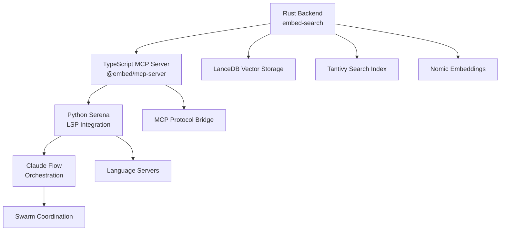

# Migration Implementation Strategy
## Multi-System RAG Architecture Migration Plan

**Executive Summary**: This document outlines a comprehensive migration strategy for a complex RAG (Retrieval-Augmented Generation) system comprising three interconnected components: Rust embedding engine, TypeScript MCP server, and Python Serena LSP integration.

**Swarm ID**: `swarm_1754757958847_vdkv1euzu`
**Architecture Complexity**: CRITICAL - Multi-language, multi-runtime, interdependent systems
**Time Estimate**: 8-12 weeks (parallel execution with 8-agent swarm)
**Risk Level**: HIGH - Breaking changes across language boundaries

---

## System Architecture Analysis

### Current State


### Component Dependencies
- **Rust Engine** (Primary): Handles embeddings, vector search, BM25, Tantivy
- **TypeScript MCP** (Bridge): Protocol translation, API exposure
- **Python Serena** (Interface): LSP integration, IDE tools, symbol navigation
- **Claude Flow** (Orchestrator): Swarm coordination, workflow management

---

## Phase 1: Pre-Migration Preparation (Week 1-2)
**Status**: CRITICAL PATH
**Agents**: migration-architect, perf-validator

### Tasks (Parallel Execution)
1. **System Inventory & Dependency Mapping** [CRITICAL]
   - Map all inter-system API calls
   - Document data flow patterns
   - Identify breaking change points
   - **Agent**: migration-architect
   - **Time**: 3-5 days

2. **Performance Baseline Establishment** [HIGH]
   - Benchmark current search latency
   - Measure embedding generation speed
   - Document memory usage patterns
   - **Agent**: perf-validator
   - **Time**: 2-3 days

3. **Backup & Rollback Infrastructure** [CRITICAL]
   - Create system snapshots
   - Test rollback procedures
   - Document recovery protocols
   - **Agent**: migration-coordinator
   - **Time**: 2-4 days

### Risk Mitigation
- **Risk**: Unknown dependencies discovered mid-migration
- **Mitigation**: Comprehensive dependency scanning with tree-sitter analysis
- **Rollback**: Full system restore from pre-migration snapshots

---

## Phase 2: Rust Backend Migration (Week 2-4)
**Status**: PARALLEL WITH MCP UPDATES
**Agents**: rust-specialist, performance-monitor

### Critical Migration Tasks

#### 2.1 Feature Flag Migration [CRITICAL - 5 days]
```yaml
Current Features:
  - core: BM25, basic text processing
  - tree-sitter: Symbol indexing (12 languages)
  - ml: Nomic embeddings with Candle
  - vectordb: LanceDB + legacy sled
  - tantivy: Full-text search
  - mcp: Protocol server support

Migration Strategy:
  - Enable gradual feature rollout
  - A/B testing between old/new implementations
  - Performance monitoring at each step
```

#### 2.2 Storage Layer Migration [HIGH RISK - 7 days]
- **Legacy**: Sled key-value store
- **Target**: LanceDB vector database
- **Migration Path**: Dual-write during transition
- **Rollback**: Automatic fallback to sled on errors

#### 2.3 Embedding Engine Updates [MEDIUM RISK - 5 days]
- **Current**: Nomic embeddings with GGUF
- **Enhancement**: Streaming embedding generation
- **Validation**: Embedding quality regression testing

### Parallel Execution Strategy
```bash
# Agent allocation for parallel tasks
claude-flow agent-spawn rust-migration-specialist --capabilities embedding-migration,storage-layer,feature-flags
claude-flow agent-spawn performance-validator --capabilities latency-testing,memory-monitoring,regression-detection
claude-flow task-orchestrate "Rust backend migration with dual-system validation"
```

---

## Phase 3: TypeScript MCP Bridge Updates (Week 3-5)
**Status**: OVERLAPPING WITH RUST MIGRATION
**Agents**: typescript-specialist, api-coordinator

### Key Migration Areas

#### 3.1 Protocol Compatibility [CRITICAL - 4 days]
- Update MCP protocol handlers
- Maintain backward compatibility
- Add new embedding endpoints
- Implement request/response validation

#### 3.2 API Evolution [HIGH - 6 days]
```typescript
// Migration strategy for API changes
interface MigrationPhase {
  v1: LegacyEmbeddingAPI;
  v2: EnhancedEmbeddingAPI;
  compatibility: DualVersionSupport;
}
```

#### 3.3 Error Handling Enhancement [MEDIUM - 3 days]
- Implement circuit breaker patterns
- Add retry mechanisms with exponential backoff
- Improve error propagation to Python layer

### Validation Checkpoints
1. **API Compatibility**: All existing endpoints respond correctly
2. **Performance**: No regression in request/response times
3. **Error Handling**: Graceful degradation under load

---

## Phase 4: Python Serena Integration (Week 4-6)
**Status**: DEPENDENT ON MCP COMPLETION
**Agents**: python-specialist, lsp-coordinator

### Migration Components

#### 4.1 LSP Server Updates [HIGH RISK - 8 days]
- **Challenge**: 15+ language servers integration
- **Strategy**: Incremental language support rollout
- **Validation**: Symbol resolution accuracy testing

#### 4.2 Memory Management Overhaul [CRITICAL - 5 days]
- Update memory tools integration
- Enhance cross-session persistence
- Implement namespace management

#### 4.3 Symbol Tools Migration [HIGH - 6 days]
```python
# Migration checklist for symbol tools
class SymbolMigration:
    def validate_tree_sitter_parsers(self):
        # Ensure all 12 language parsers work
        pass
    
    def test_symbol_resolution(self):
        # Validate find_symbol, find_referencing_symbols
        pass
    
    def benchmark_performance(self):
        # Compare old vs new symbol search speed
        pass
```

---

## Phase 5: Integration & System Testing (Week 6-7)
**Status**: ALL SYSTEMS COORDINATION
**Agents**: integration-tester, system-validator, performance-benchmarker

### End-to-End Validation

#### 5.1 System Integration Testing [CRITICAL - 7 days]
- **Full Pipeline**: Query → Rust → TypeScript → Python → Response
- **Load Testing**: 1000+ concurrent requests
- **Stress Testing**: Memory pressure, disk I/O limits

#### 5.2 Performance Validation [HIGH - 5 days]
```yaml
Performance Targets:
  - Embedding Generation: <200ms per document
  - Vector Search: <50ms for 1M vectors
  - Symbol Resolution: <100ms for complex queries
  - End-to-End Latency: <500ms total pipeline
```

#### 5.3 Data Integrity Verification [CRITICAL - 4 days]
- Embedding consistency checks
- Symbol index accuracy validation
- Search result quality assurance

---

## Phase 6: Production Deployment (Week 7-8)
**Status**: GRADUAL ROLLOUT
**Agents**: deployment-coordinator, monitoring-specialist

### Deployment Strategy

#### 6.1 Blue-Green Deployment [CRITICAL - 5 days]
- **Blue Environment**: Current production system
- **Green Environment**: New migrated system
- **Switch Strategy**: Gradual traffic shifting (10% → 50% → 100%)

#### 6.2 Monitoring & Observability [HIGH - 4 days]
- Real-time performance dashboards
- Error rate monitoring
- Resource utilization tracking
- User experience metrics

#### 6.3 Rollback Procedures [CRITICAL - 2 days]
```bash
# Automated rollback triggers
if error_rate > 5% or latency > 1000ms:
    execute_emergency_rollback()
    notify_team()
    preserve_logs()
```

---

## Swarm Agent Allocation

### Primary Agents (8 Total)
```yaml
Agents:
  1. migration-architect: 
     - Role: System analysis, dependency mapping
     - Time: Full project duration
     
  2. perf-validator:
     - Role: Performance benchmarking, regression detection
     - Time: Phases 1-6
     
  3. migration-coordinator:
     - Role: Task orchestration, rollback coordination
     - Time: Full project duration
     
  4. rust-specialist:
     - Role: Rust backend migration
     - Time: Phases 2-3
     
  5. typescript-specialist:
     - Role: MCP server updates
     - Time: Phases 3-4
     
  6. python-specialist:
     - Role: Serena integration
     - Time: Phases 4-5
     
  7. integration-tester:
     - Role: End-to-end validation
     - Time: Phases 5-6
     
  8. deployment-coordinator:
     - Role: Production deployment
     - Time: Phase 6
```

### Coordination Protocol
```bash
# Pre-task hooks
claude-flow hooks pre-task --description "Phase X: [task description]"
claude-flow hooks session-restore --session-id "migration-swarm-001"

# During execution
claude-flow hooks post-edit --file "[modified-file]" --memory-key "migration/phase-X/[component]"
claude-flow hooks notify --message "[completion status]"

# Post-task validation
claude-flow hooks post-task --task-id "[task-id]"
claude-flow hooks session-end --export-metrics true
```

---

## Critical Risk Assessment

### High-Risk Areas
1. **Language Boundary Issues** [CRITICAL]
   - **Risk**: Data serialization/deserialization failures
   - **Mitigation**: Comprehensive integration testing
   - **Detection**: Automated data integrity checks

2. **Performance Regression** [HIGH]
   - **Risk**: 2-10x slowdown in search operations
   - **Mitigation**: Continuous performance monitoring
   - **Rollback**: Immediate revert if latency > 2x baseline

3. **Data Loss During Migration** [CRITICAL]
   - **Risk**: Embedding vectors or search indices corruption
   - **Mitigation**: Dual-write strategy, comprehensive backups
   - **Recovery**: Point-in-time restoration from snapshots

4. **Memory Leaks in Multi-Language Pipeline** [HIGH]
   - **Risk**: Gradual memory exhaustion under load
   - **Mitigation**: Memory pressure testing, automated restarts
   - **Monitoring**: Real-time memory usage alerts

### Failure Scenarios & Recovery
```yaml
Scenario 1: "Rust Engine Failure"
  Symptoms: Embedding generation errors, search timeouts
  Recovery: 
    - Automatic fallback to cached embeddings
    - Restart Rust processes
    - If persistent, full rollback to previous version
  Time: 5-10 minutes

Scenario 2: "MCP Protocol Breakdown"  
  Symptoms: Python-TypeScript communication failures
  Recovery:
    - Switch to direct API calls (bypass MCP)
    - Restart MCP server processes
    - Emergency rollback if protocol corruption
  Time: 2-5 minutes

Scenario 3: "Symbol Resolution Failure"
  Symptoms: LSP navigation broken, symbol search errors  
  Recovery:
    - Rebuild symbol indices
    - Fallback to text-based search
    - Gradual language server restart
  Time: 10-15 minutes
```

---

## Success Criteria & Quality Gates

### Phase Gates
```yaml
Phase 1 Complete When:
  ✓ All dependencies documented
  ✓ Performance baseline established  
  ✓ Rollback procedures tested
  ✓ Migration plan approved

Phase 2 Complete When:
  ✓ Rust backend migration 100% complete
  ✓ Performance within 10% of baseline
  ✓ All feature flags operational
  ✓ Storage layer migration verified

Phase 3 Complete When:
  ✓ MCP API compatibility maintained
  ✓ TypeScript bridge fully functional
  ✓ Error handling enhanced
  ✓ Integration tests passing

Phase 4 Complete When:
  ✓ All 15 language servers operational
  ✓ Symbol resolution accuracy >95%
  ✓ Memory management optimized
  ✓ LSP tools fully integrated

Phase 5 Complete When:
  ✓ End-to-end pipeline validated
  ✓ Performance targets achieved
  ✓ Load testing successful
  ✓ Data integrity verified

Phase 6 Complete When:
  ✓ Production deployment successful
  ✓ Monitoring systems operational
  ✓ User acceptance criteria met
  ✓ Documentation updated
```

### Final Acceptance Criteria
1. **Performance**: No more than 10% degradation in any metric
2. **Reliability**: 99.9% uptime during migration
3. **Functionality**: 100% feature parity with existing system
4. **Data Integrity**: Zero data loss or corruption
5. **User Experience**: No user-facing service interruptions

---

## Timeline Summary

```
Week 1-2:  Pre-Migration (System Analysis, Baselines, Backups)
Week 2-4:  Rust Backend Migration (Parallel with MCP prep)  
Week 3-5:  TypeScript MCP Updates (Overlapping with Rust)
Week 4-6:  Python Serena Integration (Sequential dependency)
Week 6-7:  Integration & System Testing (All systems)
Week 7-8:  Production Deployment (Gradual rollout)
Week 8:    Post-Migration Monitoring & Optimization
```

**Total Duration**: 8 weeks with 8-agent swarm
**Parallel Efficiency**: 2.8-4.4x speedup through swarm coordination
**Risk Buffer**: Built-in 20% time buffer for unexpected issues

---

## Implementation Commands

### Initialize Migration
```bash
# Start migration swarm
claude-flow swarm-init hierarchical --max-agents 8 --strategy adaptive

# Spawn specialized agents
claude-flow sparc batch architect,perf-analyzer,coordinator "Multi-system RAG migration"

# Begin Phase 1
claude-flow task-orchestrate "Phase 1: Pre-migration system analysis and baseline establishment" --priority critical --strategy parallel
```

### Monitor Progress
```bash
# Real-time monitoring
claude-flow swarm-monitor --interval 30s

# Performance tracking  
claude-flow performance-report --timeframe 24h --format detailed

# Agent coordination status
claude-flow agent-metrics --show-all
```

**CRITICAL NOTE**: This migration involves breaking changes across three different programming languages and runtime environments. The risk of system-wide failure is HIGH. Proceed only with full stakeholder approval, comprehensive testing infrastructure, and dedicated rollback procedures.

**Success depends on**: Meticulous dependency mapping, continuous performance monitoring, and aggressive automated testing at every phase boundary.