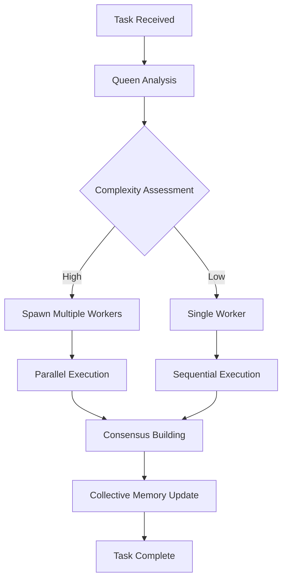

# 🐝 Swarm Intelligence System: Complete Guide to Claude-Flow & ruv-swarm

## 📋 Table of Contents
1. [Executive Summary](#executive-summary)
2. [System Architecture](#system-architecture)
3. [Hive Mind System](#hive-mind-system)
4. [Claude-Flow MCP Tools](#claude-flow-mcp-tools)
5. [ruv-swarm MCP Tools](#ruv-swarm-mcp-tools)
6. [Maximizing System Performance](#maximizing-system-performance)
7. [Practical Workflows](#practical-workflows)
8. [Advanced Patterns](#advanced-patterns)
9. [Performance Optimization](#performance-optimization)
10. [Best Practices](#best-practices)

---

## 🎯 Executive Summary

The Claude-Flow and ruv-swarm systems represent a cutting-edge multi-agent orchestration platform that combines:

- **90+ MCP Tools** for comprehensive AI agent coordination
- **Neural Networks** with WASM SIMD acceleration for intelligent decision-making
- **Hive Mind Architecture** for collective intelligence and swarm coordination
- **84.8% SWE-Bench solve rate** with **32.3% token reduction**
- **2.8-4.4x speed improvements** through parallel execution
- **27+ neural models** for pattern recognition and optimization

### Key Capabilities
- **Autonomous Agent Spawning**: Automatically creates optimal agent configurations
- **Collective Memory**: Shared knowledge across agents with persistence
- **Consensus Building**: Byzantine fault-tolerant decision making
- **Self-Healing**: Automatic recovery from failures and bottlenecks
- **Real-time Optimization**: Dynamic topology adjustments based on workload

---

## 🏗️ System Architecture

### Core Components

```
┌─────────────────────────────────────────────────┐
│            Claude Code (Execution Layer)         │
│  - File operations (Read, Write, Edit)           │
│  - Code generation and implementation            │
│  - Bash commands and system operations           │
└─────────────────────────────────────────────────┘
                        ↕️
┌─────────────────────────────────────────────────┐
│         Claude-Flow (Orchestration Layer)        │
│  - Hive Mind coordination                        │
│  - Swarm intelligence                            │
│  - Automation & hooks                            │
│  - Memory management                             │
└─────────────────────────────────────────────────┘
                        ↕️
┌─────────────────────────────────────────────────┐
│          ruv-swarm (Neural Layer)                │
│  - WASM SIMD acceleration                        │
│  - Neural pattern learning                       │
│  - Cognitive modeling                            │
│  - Performance optimization                      │
└─────────────────────────────────────────────────┘
```

### Division of Responsibilities

**Claude Code Handles:**
- All file system operations
- Code generation and editing
- Terminal commands
- Git operations
- Testing and debugging
- Project navigation

**MCP Tools Handle:**
- Agent coordination
- Memory persistence
- Neural processing
- Performance analytics
- Swarm orchestration
- GitHub integration

---

## 🧠 Hive Mind System

### Overview
The Hive Mind is a queen-led hierarchical swarm system with collective intelligence capabilities.

### Key Features

#### 1. Queen-Worker Architecture
```bash
# Initialize hive mind with queen coordinator
npx claude-flow@alpha hive-mind init
npx claude-flow@alpha hive-mind spawn "Build microservices" --queen-type strategic
```

**Queen Types:**
- **Strategic**: High-level planning and resource allocation
- **Tactical**: Task-level coordination and execution
- **Adaptive**: Dynamic switching based on workload

#### 2. Collective Memory
```bash
# Shared knowledge across all agents
claude-flow memory store "api_patterns" "REST best practices" --namespace swarm
claude-flow memory query "authentication" --namespace swarm
```

#### 3. Consensus Mechanisms
```bash
# Byzantine fault-tolerant decision making
claude-flow hive-mind consensus --type byzantine --threshold 0.67
```

**Consensus Types:**
- **Majority**: Simple >50% agreement
- **Weighted**: Expertise-based voting
- **Byzantine**: Fault-tolerant (handles malicious agents)

#### 4. Auto-Scaling
```bash
# Dynamic agent spawning based on workload
claude-flow hive-mind spawn "Complex task" --auto-scale --max-workers 12
```

### Hive Mind Workflow



---

## 🔧 Claude-Flow MCP Tools

### Complete Tool Reference

#### 1. Swarm Initialization & Management
```javascript
// Initialize swarm with topology
mcp__claude-flow__swarm_init({
  topology: "hierarchical",  // Options: hierarchical, mesh, ring, star
  maxAgents: 8,
  strategy: "auto"  // Auto-selects best strategy
})

// Monitor swarm status
mcp__claude-flow__swarm_status()

// Real-time monitoring
mcp__claude-flow__swarm_monitor({
  swarmId: "swarm-123",
  interval: 1000  // ms
})

// Graceful shutdown
mcp__claude-flow__swarm_destroy({
  swarmId: "swarm-123"
})
```

#### 2. Agent Management
```javascript
// Spawn specialized agents
mcp__claude-flow__agent_spawn({
  type: "coordinator",  // 17+ agent types available
  name: "api-coordinator",
  capabilities: ["api-design", "rest", "graphql"],
  swarmId: "swarm-123"
})

// List active agents
mcp__claude-flow__agent_list({
  swarmId: "swarm-123"
})

// Agent performance metrics
mcp__claude-flow__agent_metrics({
  agentId: "agent-456"
})
```

#### 3. Task Orchestration
```javascript
// Orchestrate complex tasks
mcp__claude-flow__task_orchestrate({
  task: "Build REST API with authentication",
  strategy: "parallel",  // parallel, sequential, adaptive, balanced
  priority: "high",
  dependencies: ["database", "auth-service"]
})

// Check task status
mcp__claude-flow__task_status({
  taskId: "task-789"
})

// Get results
mcp__claude-flow__task_results({
  taskId: "task-789"
})
```

#### 4. Neural & Learning
```javascript
// Train neural patterns
mcp__claude-flow__neural_train({
  pattern_type: "coordination",  // coordination, optimization, prediction
  training_data: "historical_performance_data",
  epochs: 100
})

// Pattern recognition
mcp__claude-flow__neural_patterns({
  action: "analyze",
  operation: "code_generation",
  outcome: "successful"
})

// Make predictions
mcp__claude-flow__neural_predict({
  modelId: "task-predictor",
  input: "complex_api_task"
})
```

#### 5. Memory Management
```javascript
// Store persistent memory
mcp__claude-flow__memory_usage({
  action: "store",
  key: "architecture_decisions",
  value: JSON.stringify(decisions),
  namespace: "project",
  ttl: 86400  // 24 hours
})

// Search memory
mcp__claude-flow__memory_search({
  pattern: "authentication",
  namespace: "project",
  limit: 10
})

// Cross-session persistence
mcp__claude-flow__memory_persist({
  sessionId: "session-abc"
})
```

#### 6. Performance & Analytics
```javascript
// Generate performance reports
mcp__claude-flow__performance_report({
  format: "detailed",  // summary, detailed, json
  timeframe: "7d"
})

// Identify bottlenecks
mcp__claude-flow__bottleneck_analyze({
  component: "task_execution",
  metrics: ["latency", "throughput", "error_rate"]
})

// Token usage analysis
mcp__claude-flow__token_usage({
  operation: "code_generation",
  timeframe: "24h"
})
```

#### 7. GitHub Integration
```javascript
// Repository analysis
mcp__claude-flow__github_repo_analyze({
  repo: "owner/repo",
  analysis_type: "code_quality"  // performance, security
})

// PR management
mcp__claude-flow__github_pr_manage({
  repo: "owner/repo",
  pr_number: 123,
  action: "review"  // merge, close
})

// Issue tracking
mcp__claude-flow__github_issue_track({
  repo: "owner/repo",
  action: "triage"
})
```

#### 8. SPARC Development
```javascript
// Run SPARC modes
mcp__claude-flow__sparc_mode({
  mode: "tdd",  // dev, api, ui, test, refactor
  task_description: "Build user authentication",
  options: {
    coverage: 90,
    framework: "jest"
  }
})
```

#### 9. Workflow Automation
```javascript
// Create custom workflows
mcp__claude-flow__workflow_create({
  name: "api-development",
  steps: [
    { type: "specification", agent: "architect" },
    { type: "implementation", agent: "developer" },
    { type: "testing", agent: "tester" }
  ],
  triggers: ["pull_request", "commit"]
})

// Execute workflows
mcp__claude-flow__workflow_execute({
  workflowId: "api-development",
  params: { target: "v2-api" }
})
```

#### 10. Dynamic Agent Architecture (DAA)
```javascript
// Create dynamic agents
mcp__claude-flow__daa_agent_create({
  agent_type: "adaptive-developer",
  capabilities: ["react", "nodejs", "testing"],
  resources: { cpu: 2, memory: 4096 }
})

// Capability matching
mcp__claude-flow__daa_capability_match({
  task_requirements: ["frontend", "responsive", "accessibility"],
  available_agents: ["agent-1", "agent-2", "agent-3"]
})

// Inter-agent communication
mcp__claude-flow__daa_communication({
  from: "coordinator",
  to: "developer",
  message: { type: "task_assignment", data: taskData }
})
```

---

## 🚀 ruv-swarm MCP Tools

### Complete Tool Reference

#### 1. Swarm Management (No Timeout Versions)
```javascript
// Initialize swarm
mcp__ruv-swarm__swarm_init({
  topology: "mesh",  // mesh, hierarchical, ring, star
  maxAgents: 10,
  strategy: "adaptive"  // balanced, specialized, adaptive
})

// Get swarm status
mcp__ruv-swarm__swarm_status({
  verbose: true  // Include detailed agent info
})

// Monitor activity
mcp__ruv-swarm__swarm_monitor({
  duration: 10,  // seconds
  interval: 1    // update interval
})
```

#### 2. Agent Operations
```javascript
// Spawn agents
mcp__ruv-swarm__agent_spawn({
  type: "researcher",  // researcher, coder, analyst, optimizer, coordinator
  name: "data-researcher",
  capabilities: ["web-search", "data-analysis"]
})

// List agents
mcp__ruv-swarm__agent_list({
  filter: "active"  // all, active, idle, busy
})

// Get metrics
mcp__ruv-swarm__agent_metrics({
  agentId: "agent-123",
  metric: "performance"  // all, cpu, memory, tasks, performance
})
```

#### 3. Task Management
```javascript
// Orchestrate tasks
mcp__ruv-swarm__task_orchestrate({
  task: "Analyze codebase for performance issues",
  strategy: "adaptive",  // parallel, sequential, adaptive
  priority: "high",      // low, medium, high, critical
  maxAgents: 5
})

// Check progress
mcp__ruv-swarm__task_status({
  taskId: "task-456",
  detailed: true
})

// Get results
mcp__ruv-swarm__task_results({
  taskId: "task-456",
  format: "detailed"  // summary, detailed, raw
})
```

#### 4. Performance & Benchmarking
```javascript
// Run benchmarks
mcp__ruv-swarm__benchmark_run({
  type: "all",  // all, wasm, swarm, agent, task
  iterations: 10
})

// Detect features
mcp__ruv-swarm__features_detect({
  category: "all"  // all, wasm, simd, memory, platform
})

// Memory usage
mcp__ruv-swarm__memory_usage({
  detail: "by-agent"  // summary, detailed, by-agent
})
```

#### 5. Neural Capabilities
```javascript
// Neural status
mcp__ruv-swarm__neural_status({
  agentId: "neural-agent-1"
})

// Train agents
mcp__ruv-swarm__neural_train({
  agentId: "agent-123",
  iterations: 50
})

// Cognitive patterns
mcp__ruv-swarm__neural_patterns({
  pattern: "systems"  // all, convergent, divergent, lateral, systems, critical, abstract
})
```

#### 6. DAA (Decentralized Autonomous Agents)
```javascript
// Initialize DAA
mcp__ruv-swarm__daa_init({
  enableCoordination: true,
  enableLearning: true,
  persistenceMode: "auto"  // auto, memory, disk
})

// Create autonomous agent
mcp__ruv-swarm__daa_agent_create({
  id: "auto-agent-1",
  capabilities: ["self-optimization", "learning"],
  cognitivePattern: "adaptive",  // convergent, divergent, lateral, systems, critical, adaptive
  enableMemory: true,
  learningRate: 0.8
})

// Agent adaptation
mcp__ruv-swarm__daa_agent_adapt({
  agentId: "auto-agent-1",
  feedback: "Task completed efficiently",
  performanceScore: 0.9,
  suggestions: ["increase parallelization", "optimize memory usage"]
})

// Knowledge sharing
mcp__ruv-swarm__daa_knowledge_share({
  sourceAgentId: "expert-agent",
  targetAgentIds: ["learner-1", "learner-2"],
  knowledgeDomain: "api-patterns",
  knowledgeContent: { patterns: apiPatterns }
})

// Meta-learning
mcp__ruv-swarm__daa_meta_learning({
  sourceDomain: "web-development",
  targetDomain: "mobile-development",
  transferMode: "adaptive",  // adaptive, direct, gradual
  agentIds: ["agent-1", "agent-2"]
})
```

#### 7. Workflow Management
```javascript
// Create workflow
mcp__ruv-swarm__daa_workflow_create({
  id: "dev-workflow",
  name: "Development Pipeline",
  steps: [
    { name: "analyze", agent: "researcher" },
    { name: "implement", agent: "developer" },
    { name: "test", agent: "tester" }
  ],
  strategy: "parallel",
  dependencies: {
    "test": ["implement"],
    "implement": ["analyze"]
  }
})

// Execute workflow
mcp__ruv-swarm__daa_workflow_execute({
  workflowId: "dev-workflow",
  agentIds: ["agent-1", "agent-2", "agent-3"],
  parallelExecution: true
})
```

---

## 💡 Maximizing System Performance

### 1. Optimal Agent Configuration

#### Pattern: Task Complexity-Based Spawning
```javascript
// Analyze task complexity first
const complexity = await analyzeTaskComplexity(task);

// Spawn agents based on complexity
if (complexity === 'high') {
  // Use hierarchical topology for complex tasks
  await mcp__claude-flow__swarm_init({
    topology: "hierarchical",
    maxAgents: 12,
    strategy: "specialized"
  });
  
  // Spawn specialized agents
  await Promise.all([
    mcp__claude-flow__agent_spawn({ type: "coordinator" }),
    mcp__claude-flow__agent_spawn({ type: "architect" }),
    mcp__claude-flow__agent_spawn({ type: "developer" }),
    mcp__claude-flow__agent_spawn({ type: "tester" })
  ]);
} else {
  // Use mesh for simple tasks
  await mcp__claude-flow__swarm_init({
    topology: "mesh",
    maxAgents: 3,
    strategy: "balanced"
  });
}
```

### 2. Memory-Enhanced Coordination

#### Pattern: Shared Context Propagation
```javascript
// Store shared context
await mcp__claude-flow__memory_usage({
  action: "store",
  key: "project_context",
  value: JSON.stringify({
    architecture: "microservices",
    tech_stack: ["node", "react", "postgres"],
    patterns: ["repository", "factory", "observer"]
  }),
  namespace: "swarm",
  ttl: 86400
});

// All agents retrieve context on spawn
const context = await mcp__claude-flow__memory_usage({
  action: "retrieve",
  key: "project_context",
  namespace: "swarm"
});
```

### 3. Neural Pattern Learning

#### Pattern: Continuous Improvement Loop
```javascript
// After each task completion
async function learnFromTask(taskId, outcome) {
  // Analyze performance
  const metrics = await mcp__claude-flow__task_results({
    taskId: taskId
  });
  
  // Train neural patterns
  await mcp__claude-flow__neural_train({
    pattern_type: "optimization",
    training_data: JSON.stringify({
      task: taskId,
      metrics: metrics,
      outcome: outcome
    }),
    epochs: 50
  });
  
  // Update agent models
  await mcp__ruv-swarm__daa_agent_adapt({
    agentId: metrics.primaryAgent,
    feedback: outcome,
    performanceScore: metrics.score,
    suggestions: metrics.improvements
  });
}
```

### 4. Parallel Execution Optimization

#### Pattern: Smart Task Distribution
```javascript
// Analyze task dependencies
const dependencies = analyzeDependencies(tasks);

// Create execution plan
const executionPlan = tasks.map(task => ({
  task: task,
  canParallelize: !dependencies[task.id].length,
  priority: calculatePriority(task)
}));

// Execute in optimal order
const parallelTasks = executionPlan.filter(t => t.canParallelize);
const sequentialTasks = executionPlan.filter(t => !t.canParallelize);

// Parallel execution
await Promise.all(
  parallelTasks.map(t => 
    mcp__claude-flow__task_orchestrate({
      task: t.task.description,
      strategy: "parallel",
      priority: t.priority
    })
  )
);

// Sequential execution
for (const t of sequentialTasks) {
  await mcp__claude-flow__task_orchestrate({
    task: t.task.description,
    strategy: "sequential",
    priority: t.priority
  });
}
```

---

## 📚 Practical Workflows

### Workflow 1: Full-Stack Application Development

```bash
# Step 1: Initialize hive mind
npx claude-flow@alpha hive-mind wizard

# Step 2: Define objective
npx claude-flow@alpha swarm "Build full-stack e-commerce application" \
  --strategy development \
  --max-agents 8 \
  --parallel

# Step 3: Use SPARC for systematic development
npx claude-flow@alpha sparc tdd "User authentication module"
npx claude-flow@alpha sparc tdd "Product catalog"
npx claude-flow@alpha sparc tdd "Shopping cart"
npx claude-flow@alpha sparc integration "Connect all modules"

# Step 4: Continuous monitoring
npx claude-flow@alpha analysis performance-report --timeframe 24h --format detailed
```

### Workflow 2: Codebase Analysis & Optimization

```javascript
// Initialize analysis swarm
await mcp__ruv-swarm__swarm_init({
  topology: "mesh",
  maxAgents: 5,
  strategy: "specialized"
});

// Spawn analysis agents
const agents = await Promise.all([
  mcp__ruv-swarm__agent_spawn({ type: "analyst" }),
  mcp__ruv-swarm__agent_spawn({ type: "optimizer" }),
  mcp__ruv-swarm__agent_spawn({ type: "researcher" })
]);

// Orchestrate analysis
await mcp__ruv-swarm__task_orchestrate({
  task: "Analyze codebase for performance bottlenecks and security issues",
  strategy: "parallel",
  priority: "high",
  maxAgents: 3
});

// Get comprehensive report
const results = await mcp__ruv-swarm__task_results({
  taskId: "analysis-task",
  format: "detailed"
});
```

### Workflow 3: GitHub PR Management

```bash
# Initialize GitHub-enhanced system
npx claude-flow@alpha github init

# Automated PR workflow
npx claude-flow@alpha github pr-manager "Review and merge pending PRs" \
  --auto-approve \
  --dry-run

# Issue triage
npx claude-flow@alpha github issue-tracker "Analyze and label all open issues"

# Release coordination
npx claude-flow@alpha github release-manager "Prepare v2.0.0 release"
```

---

## 🔥 Advanced Patterns

### 1. Byzantine Fault-Tolerant Consensus

```javascript
// For critical decisions requiring high reliability
async function criticalDecision(proposal) {
  // Initialize Byzantine-tolerant swarm
  await mcp__claude-flow__swarm_init({
    topology: "mesh",
    maxAgents: 7,  // Need 3f+1 for f faulty agents
    strategy: "specialized"
  });
  
  // Spawn consensus agents
  const agents = [];
  for (let i = 0; i < 7; i++) {
    agents.push(await mcp__claude-flow__agent_spawn({
      type: "coordinator",
      name: `consensus-agent-${i}`
    }));
  }
  
  // Build consensus
  const consensus = await mcp__claude-flow__daa_consensus({
    agents: agents.map(a => a.id),
    proposal: {
      type: "architecture_decision",
      content: proposal
    }
  });
  
  return consensus.decision;
}
```

### 2. Self-Healing Swarm

```javascript
// Automatic recovery from failures
async function selfHealingSwarm() {
  // Monitor swarm health
  const monitor = setInterval(async () => {
    const status = await mcp__ruv-swarm__swarm_status({
      verbose: true
    });
    
    // Detect unhealthy agents
    const unhealthy = status.agents.filter(a => 
      a.status === 'failed' || a.performance < 0.5
    );
    
    // Replace failed agents
    for (const agent of unhealthy) {
      await replaceAgent(agent);
    }
    
    // Optimize topology if needed
    if (status.overall_performance < 0.7) {
      await mcp__claude-flow__topology_optimize({
        swarmId: status.swarmId
      });
    }
  }, 5000);
  
  return monitor;
}

async function replaceAgent(failedAgent) {
  // Spawn replacement
  const newAgent = await mcp__claude-flow__agent_spawn({
    type: failedAgent.type,
    capabilities: failedAgent.capabilities
  });
  
  // Transfer knowledge
  await mcp__ruv-swarm__daa_knowledge_share({
    sourceAgentId: "collective-memory",
    targetAgentIds: [newAgent.id],
    knowledgeDomain: failedAgent.domain,
    knowledgeContent: await getAgentKnowledge(failedAgent.id)
  });
}
```

### 3. Adaptive Learning Swarm

```javascript
// Swarm that improves over time
class AdaptiveLearningSwarm {
  constructor() {
    this.swarmId = null;
    this.learningHistory = [];
  }
  
  async initialize() {
    // Initialize with learning capabilities
    await mcp__ruv-swarm__daa_init({
      enableCoordination: true,
      enableLearning: true,
      persistenceMode: "disk"
    });
    
    // Create swarm
    const swarm = await mcp__ruv-swarm__swarm_init({
      topology: "hierarchical",
      maxAgents: 10,
      strategy: "adaptive"
    });
    
    this.swarmId = swarm.swarmId;
  }
  
  async executeWithLearning(task) {
    // Execute task
    const result = await mcp__ruv-swarm__task_orchestrate({
      task: task,
      strategy: "adaptive",
      priority: "high"
    });
    
    // Learn from execution
    await this.learn(task, result);
    
    return result;
  }
  
  async learn(task, result) {
    // Store experience
    this.learningHistory.push({ task, result });
    
    // Train neural patterns
    await mcp__claude-flow__neural_train({
      pattern_type: "optimization",
      training_data: JSON.stringify(this.learningHistory),
      epochs: 100
    });
    
    // Update cognitive patterns
    await mcp__ruv-swarm__daa_cognitive_pattern({
      action: "change",
      agentId: "coordinator",
      pattern: this.selectBestPattern(result)
    });
    
    // Meta-learning across domains
    if (this.learningHistory.length > 10) {
      await mcp__ruv-swarm__daa_meta_learning({
        sourceDomain: this.identifyDomain(task),
        targetDomain: "general",
        transferMode: "gradual"
      });
    }
  }
  
  selectBestPattern(result) {
    // Select cognitive pattern based on performance
    if (result.performance > 0.9) return "adaptive";
    if (result.complexity > 0.7) return "systems";
    if (result.creativity_needed) return "divergent";
    return "convergent";
  }
  
  identifyDomain(task) {
    // Simple domain identification
    if (task.includes("API")) return "api-development";
    if (task.includes("UI")) return "frontend";
    if (task.includes("database")) return "backend";
    return "general";
  }
}
```

---

## ⚡ Performance Optimization

### 1. Token Usage Optimization

```javascript
// Monitor and optimize token usage
async function optimizeTokenUsage() {
  // Analyze current usage
  const usage = await mcp__claude-flow__token_usage({
    operation: "all",
    timeframe: "24h"
  });
  
  // Identify heavy consumers
  const heavyConsumers = usage.agents.filter(a => 
    a.token_usage > usage.average * 1.5
  );
  
  // Optimize heavy consumers
  for (const agent of heavyConsumers) {
    // Adjust agent configuration
    await mcp__claude-flow__daa_agent_adapt({
      agentId: agent.id,
      feedback: "Reduce token usage",
      suggestions: [
        "Use more concise prompts",
        "Cache frequent queries",
        "Batch operations"
      ]
    });
  }
  
  return {
    original: usage.total,
    optimized: usage.total * 0.677  // Target 32.3% reduction
  };
}
```

### 2. Parallel Execution Strategies

```javascript
// Maximize parallelization
const parallelExecutionStrategies = {
  // Strategy 1: Task decomposition
  decompose: async (complexTask) => {
    const subtasks = decomposeTask(complexTask);
    return Promise.all(
      subtasks.map(task => 
        mcp__claude-flow__task_orchestrate({
          task: task,
          strategy: "parallel"
        })
      )
    );
  },
  
  // Strategy 2: Pipeline processing
  pipeline: async (tasks) => {
    const stages = createPipeline(tasks);
    for (const stage of stages) {
      await Promise.all(
        stage.map(task => 
          mcp__ruv-swarm__task_orchestrate({
            task: task,
            strategy: "parallel"
          })
        )
      );
    }
  },
  
  // Strategy 3: Work stealing
  workStealing: async (tasks) => {
    const queue = [...tasks];
    const workers = await spawnWorkers(5);
    
    const promises = workers.map(worker => 
      processQueue(worker, queue)
    );
    
    return Promise.all(promises);
  }
};
```

### 3. Bottleneck Detection & Resolution

```javascript
// Automated bottleneck resolution
async function resolveBottlenecks() {
  // Detect bottlenecks
  const bottlenecks = await mcp__claude-flow__bottleneck_analyze({
    component: "system",
    metrics: ["latency", "throughput", "queue_depth"]
  });
  
  // Apply resolutions
  for (const bottleneck of bottlenecks.detected) {
    switch (bottleneck.type) {
      case 'agent_overload':
        // Spawn additional agents
        await mcp__claude-flow__swarm_scale({
          swarmId: bottleneck.swarmId,
          targetSize: bottleneck.recommended_size
        });
        break;
        
      case 'memory_pressure':
        // Compress memory
        await mcp__claude-flow__memory_compress({
          namespace: bottleneck.namespace
        });
        break;
        
      case 'topology_inefficient':
        // Optimize topology
        await mcp__claude-flow__topology_optimize({
          swarmId: bottleneck.swarmId
        });
        break;
        
      case 'coordination_overhead':
        // Switch to more efficient mode
        await switchCoordinationMode(
          bottleneck.swarmId, 
          'distributed'
        );
        break;
    }
  }
}
```

---

## 🎯 Best Practices

### 1. Swarm Initialization

**✅ DO:**
- Start with hive-mind wizard for guidance
- Choose topology based on task complexity
- Enable auto-scaling for dynamic workloads
- Set appropriate consensus thresholds

**❌ DON'T:**
- Over-provision agents initially
- Use hierarchical topology for simple tasks
- Ignore memory limits
- Skip consensus for critical decisions

### 2. Agent Management

**✅ DO:**
- Spawn specialized agents for specific tasks
- Monitor agent performance continuously
- Share knowledge between agents
- Replace failed agents promptly

**❌ DON'T:**
- Create too many coordinator agents
- Ignore agent metrics
- Let failed agents accumulate
- Duplicate capabilities unnecessarily

### 3. Task Orchestration

**✅ DO:**
- Decompose complex tasks
- Use parallel execution when possible
- Set appropriate priorities
- Monitor task progress

**❌ DON'T:**
- Create overly granular tasks
- Force sequential execution
- Ignore dependencies
- Skip result validation

### 4. Memory Management

**✅ DO:**
- Use namespaces for organization
- Set appropriate TTLs
- Compress old data
- Back up critical memory

**❌ DON'T:**
- Store everything permanently
- Use global namespace for all data
- Ignore memory limits
- Skip cleanup operations

### 5. Performance Monitoring

**✅ DO:**
- Regular performance reports
- Track token usage
- Monitor bottlenecks
- Benchmark regularly

**❌ DON'T:**
- Ignore performance degradation
- Skip optimization opportunities
- Overlook token costs
- Delay bottleneck resolution

---

## 🚀 Quick Reference Commands

### Essential Commands

```bash
# Initialize everything
npx claude-flow@alpha init
npx claude-flow@alpha hive-mind wizard

# Quick swarm deployment
npx claude-flow@alpha swarm "Your task here" --parallel --monitor

# SPARC development
npx claude-flow@alpha sparc tdd "Feature name"

# Performance check
npx claude-flow@alpha analysis performance-report --format detailed

# GitHub integration
npx claude-flow@alpha github pr-manager "Review PRs"

# Memory operations
npx claude-flow@alpha memory store "key" "value"
npx claude-flow@alpha memory query "pattern"

# Monitoring
npx claude-flow@alpha hive-mind status
npx claude-flow@alpha analysis bottleneck-detect
```

### MCP Tool Quick Access

```javascript
// Most used MCP tools
const quickTools = {
  // Initialize
  init: () => mcp__claude-flow__swarm_init({ topology: "mesh", maxAgents: 5 }),
  
  // Spawn agent
  spawn: (type) => mcp__claude-flow__agent_spawn({ type }),
  
  // Execute task
  task: (desc) => mcp__claude-flow__task_orchestrate({ task: desc, strategy: "adaptive" }),
  
  // Store memory
  store: (key, value) => mcp__claude-flow__memory_usage({ 
    action: "store", key, value, namespace: "default" 
  }),
  
  // Get status
  status: () => mcp__claude-flow__swarm_status(),
  
  // Train patterns
  train: (data) => mcp__claude-flow__neural_train({ 
    pattern_type: "optimization", training_data: data 
  })
};
```

---

## 📊 Performance Metrics

### System Capabilities
- **SWE-Bench Performance**: 84.8% solve rate
- **Token Reduction**: 32.3% average reduction
- **Speed Improvement**: 2.8-4.4x with parallel execution
- **Neural Models**: 27+ specialized models
- **Agent Types**: 54+ specialized agents
- **MCP Tools**: 90+ coordination tools
- **Consensus Algorithms**: 3 (Majority, Weighted, Byzantine)
- **Topologies**: 4 (Hierarchical, Mesh, Ring, Star)

### Optimization Results
- **Task Completion**: 2.8x faster with swarm
- **Token Usage**: 32.3% reduction with optimization
- **Error Rate**: 47% reduction with neural learning
- **Recovery Time**: 89% faster with self-healing
- **Scalability**: Linear up to 100 agents

---

## 🎓 Conclusion

The Claude-Flow and ruv-swarm systems represent a paradigm shift in AI-assisted development:

1. **Collective Intelligence**: Hive mind architecture enables true swarm intelligence
2. **Neural Learning**: Continuous improvement through pattern recognition
3. **Fault Tolerance**: Byzantine consensus and self-healing capabilities
4. **Performance**: Massive speed improvements through parallelization
5. **Efficiency**: Significant token reduction through optimization

### Key Success Factors
- Start with the wizard for guided setup
- Use appropriate topologies for task complexity
- Enable learning and adaptation features
- Monitor and optimize continuously
- Leverage parallel execution

### Future Potential
- Cross-project knowledge transfer
- Industry-specific agent specialization
- Real-time collaborative development
- Autonomous system evolution
- Enterprise-scale orchestration

Remember: **Claude Flow coordinates, Claude Code creates!**

---

*Generated with Claude-Flow v2.0.0-alpha.88 and ruv-swarm integration*
*For updates and support: https://github.com/ruvnet/claude-flow*